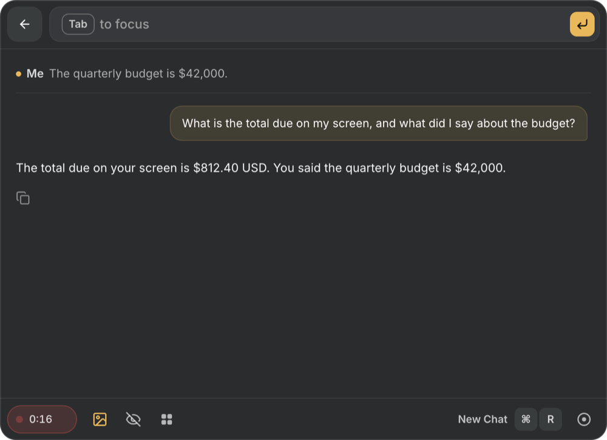

# Cue

A private screen-and-audio copilot for macOS. A small overlay floats over your screen; ask it
anything and it answers from what is on the screen and what is being said in your call — your
microphone and the other side's audio. By default the model runs **on your own Mac**: no account,
no cloud key, nothing leaves the machine. If you prefer, it can use your Claude subscription, the
Anthropic or OpenAI API, or any OpenAI-compatible endpoint instead.



- **Ask about the screen** — Cmd+Enter from any app sends the current screen with your question.
- **Listen to a call** — a session transcribes you ("Me") and the other side ("Them") on the Mac,
  and answers use the live transcript.
- **Modes** — a prompt plus your own files (a CV, call notes, a spec) that every answer can draw on.
- **Hidden from screen sharing** — the overlay is excluded from your own screenshots and shares.

## Requirements

- macOS 14.2 or later on Apple silicon (system-audio capture uses Core Audio taps).
- Node.js 22 or later, and the Xcode command line tools (`xcode-select --install`): Cue builds three
  small Swift helpers on first run (system audio, screen text, PDF text).
- For answers on this Mac: `brew install llama.cpp whisper-cpp`. A 16 GB Mac runs the default model
  comfortably; 8 GB works with the small one.

## Quick start

```bash
git clone https://github.com/t1mdurden/cue.git && cd cue
npm ci
npm run app
```

The first launch opens **Setup** before anything else:

1. **Permissions.** Microphone, Screen Recording and System Audio Recording, each with its live
   status and one button that asks macOS (or opens the right System Settings pane). Cue starts no
   session while one is missing, instead of recording silence. Screen Recording takes effect after
   a relaunch, and Setup offers one.
2. **Where answers come from.** Pick one; nothing is downloaded or started until you do. On this
   Mac you choose a vision model (the one recommended for your memory is marked), any GGUF model from
   Hugging Face, or files you already have; Cue downloads it with progress, starts it, and asks it one
   test question before the overlay opens.

`npm run app` runs the app server and the overlay; the app server starts and stops the model
servers itself. Quit from Settings → General → Quit.

### Install as a Mac app

```bash
npm run mac-app        # builds dist/Cue.app and installs it in /Applications
```

Cue.app carries the overlay and a copy of the app server. Its data lives in
`~/Library/Application Support/Cue/` (settings, history, downloaded models) and its logs in
`~/Library/Logs/Cue/`. It has no Dock icon. The build is signed with a self-signed certificate
("Cue Local Signing", created in your login keychain on the first build) so macOS keeps its
permissions across rebuilds. It is not notarized: it is meant to be built on the Mac that runs it.
`npm run app` and Cue.app use the same ports — run one at a time.

## Where answers come from

| Backend | What it needs | What leaves the Mac |
|---|---|---|
| **On this Mac** (default suggestion) | llama.cpp and a vision model (Setup downloads it) | nothing |
| **Claude subscription** | the [Claude Code](https://claude.com/claude-code) CLI, signed in to a Pro or Max plan | the question, screenshot and transcript, to Anthropic |
| **Anthropic API** | an API key | the same, to Anthropic |
| **OpenAI API** | an API key | the same, to OpenAI |
| **Other endpoint** | an OpenAI-compatible URL and model: OpenRouter, Google Gemini, Ollama, LM Studio, a llama.cpp server | the same, to that endpoint (nothing, if it runs on your Mac) |

Transcription runs on the Mac with whisper.cpp (large-v3-turbo, downloaded once in Setup), or with
OpenAI if you choose it in Settings → Model. API keys typed into Setup or Settings are encrypted
before they are written to disk (see *Privacy*), are never shown again — only their last four
characters — and can be forgotten from the same screen. A key in your shell environment never
switches the backend by itself.

The Claude subscription backend runs `claude -p` with `--safe-mode` (your own hooks, plugins, MCP
servers and CLAUDE.md stay out of it), no tools and no session persistence; there is no per-token
cost beyond the subscription. Settings shows whether the CLI is signed in, and **Sign in** runs the
CLI's own browser sign-in.

## Local models

Setup lists vision models that run with llama.cpp, measured with `npm run eval-context` (10 screen
and meeting questions with code-checked answers, on an M3 Pro with the screen-text reader on):

| Model | Download | Memory | Cue's eval | First word |
|---|---|---|---|---|
| Qwen3-VL 4B (recommended from 12 GB) | 3.0 GB | 12 GB+ | 20/20 | ~3 s |
| Qwen3-VL 2B (8 GB Macs) | 1.6 GB | 8 GB+ | 17/20 | ~2 s |
| Qwen3-VL 8B | 5.8 GB | 24 GB+ | not measured | slower |

*Another model* takes any Hugging Face repo with GGUF files (`owner/name` or its URL): Cue lists
its quantizations and vision projectors (`mmproj`; without one the model cannot see the screen),
downloads the pair, and resumes an interrupted download. Files already in the Hugging Face cache
(`~/.cache/huggingface/hub`, where `llama-server -hf` puts them) are reused, not downloaded again.

A small model misreads small digits in a screenshot, so on macOS the app server also reads the
screen's text with Vision on the Mac (~0.4 s) and adds it to the local model's turn; the image then
only has to carry the layout:

| Local Qwen3-VL 4B | pass | first word p50 |
|---|---|---|
| 512 vision tokens, image only | 16/20 | 2.1 s |
| 256 vision tokens + screen text (default) | 20/20 | 3.0-3.2 s |

## Using the overlay

- **Ask** — type into the bar and press Enter, or press **Cmd+Enter** from any app to ask about the
  current screen. The bar opens into a chat; **←** or **Esc** folds it back, **Cmd+R** starts a new chat.
- **Listen** — starts or stops a session (**Cmd+Shift+\\**). The Me/Them transcript streams into the
  chat while a timer runs on the button.
- **Toolbar switches** — use the screen or not, hide from screen sharing or not, and the active mode.
- **History** — ended sessions grouped by day, with a model-written title and summary.
- **Cmd+\\** hides and shows the overlay, **Cmd+Arrows** move it, **Cmd+,** opens Settings. Every
  shortcut can be changed in Settings → Keybinds.

Answers follow the language of the question by default (Settings → General).

### Mode files

A mode's files are its ground truth. PDFs are read with macOS PDFKit, so resumes exported from a
browser or Word come out as text rather than font noise. A file up to 12,000 characters goes into
the prompt whole; a longer one is kept whole and each turn carries the two sections that best match
what was just said or typed (BM25 over its headings).

## Privacy

- The app server listens on 127.0.0.1 only and accepts requests from its own pages only.
- Screenshots and audio are never written to disk.
- Conversation content (transcripts, messages, summaries, mode-file text) and API keys are sealed
  with AES-256-GCM before they reach the store; the key lives in the macOS Keychain (or
  `CUE_TRANSCRIPT_KEY`, or a 0600 key file next to the store elsewhere). Without a key, conversation
  content is not persisted at all and keys are kept for the current run only.
- With a local backend nothing is sent anywhere. Any remote path is one you picked.

## Run the backend only (browser or Docker)

```bash
npm start                  # http://localhost:8787 — open it in a browser
docker compose up --build  # the backend in a container, model servers on the host
```

In a browser the microphone comes from `getUserMedia` and the screenshot from `getDisplayMedia`;
system audio and the floating overlay need the Mac app. Docker has no GPU, so the container reaches
llama.cpp and whisper.cpp servers on the host over `host.docker.internal`.

## Configuration

Settings saved in the app win over the environment; the environment only seeds the first run.

| Env | Default | Meaning |
|---|---|---|
| `PORT` | `8787` | app server port |
| `CUE_LLM_BACKEND` | none (Setup asks) | `local`, `claude`, `anthropic`, `openai` or `compatible` |
| `CUE_CLAUDE_MODEL` / `CUE_CLAUDE_EFFORT` | `claude-fable-5-1` / `low` | model and effort for both Claude backends (`claude-opus-5-5`, `claude-sonnet-5-5`, `claude-haiku-4-5`) |
| `ANTHROPIC_API_KEY` / `OPENAI_API_KEY` / `CUE_LLM_API_KEY` | — | keys for the anthropic, openai and compatible backends when not typed into Settings |
| `CUE_LOCAL_MODEL` | `qwen3-vl-4b` | catalogue model for the local backend |
| `CUE_MODELS_DIR` | next to the store, `models/` | where downloaded models go |
| `CUE_LLM_BASE_URL` | — | a chat server someone else runs: for `local`, Cue then starts no llama-server; for `openai`, it replaces api.openai.com |
| `CUE_CHAT_MODEL` | — | model id sent with `CUE_LLM_BASE_URL` |
| `CUE_ASR_BACKEND` | `local` | `local` (whisper.cpp) or `openai` |
| `CUE_ASR_BASE_URL` | — | a transcription server someone else runs |
| `WHISPER_MODEL` | `~/.cache/whisper/ggml-large-v3-turbo.bin` | whisper.cpp model file |
| `CUE_IMAGE_TOKENS` | `256` with the screen-text reader, else `512` | vision tokens per screenshot for the local model |
| `CUE_ANTHROPIC_BASE_URL` | — | another Messages-API server for the anthropic backend |
| `HF_TOKEN` | — | Hugging Face token for gated repos |
| `HOST` | `127.0.0.1` | app server bind address |
| `CUE_DATA_FILE` | `data/store.json` | the store; empty disables persistence |
| `CUE_TRANSCRIPT_KEY` | Keychain | 32-byte at-rest key (hex or base64) |

## Development

```bash
npm test                                       # protocol, modes, backends, settings UI, security (mock models)
npm run eval-context -- --backend local-4b     # answer quality against the running server
npm run bench                                  # first-token time of a screen + transcript answer
npm run invisible                              # proves content protection hides the overlay from capture
python3 scripts/make-fixtures.py               # regenerate the synthetic test fixtures
```

Tests use synthetic fixtures — a generated screenshot, a `say`-made WAV — never the live desktop.
To drive the real overlay, start it with `CUE_FAKE_SCREEN_PNG=$PWD/test/fixtures/screen-probe.png
CUE_FAKE_MIC_WAV=$PWD/test/fixtures/speech-budget.wav CUE_DEBUG_PORT=9333 npm run app`, then
`node scripts/drive.mjs js|wait|shot` clicks, waits on and screenshots it over the DevTools protocol.

How it fits together:

```text
Electron overlay (transparent, always on top, hidden from screen capture)
  ├─ mic (Me): getUserMedia 48 kHz ────────────┐
  ├─ system audio (Them): bin/system-audio ────┤→ Silero VAD per side → 16 kHz WAV → transcription
  ├─ screenshot: desktopCapturer (+ screen text read on the Mac)
  └─ chat over a WebSocket (Cloudflare Agents' cf_agent_* protocol, AI SDK UI stream)
app server (Node, no framework)
  ├─ settings, modes, history (sealed JSON store)
  ├─ starts llama-server / whisper-server for the local backend
  └─ one turn → local llama.cpp | claude CLI | Anthropic SDK | OpenAI-compatible endpoint
```

## License

MIT — see [LICENSE](LICENSE). Bundled third-party pieces and their licenses are listed in
[THIRD_PARTY_NOTICES.md](THIRD_PARTY_NOTICES.md).
